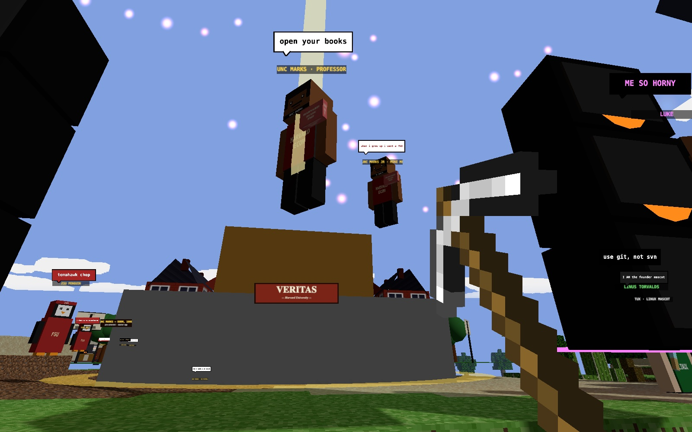
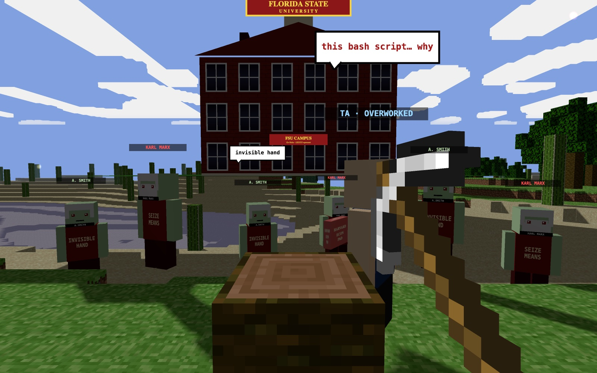
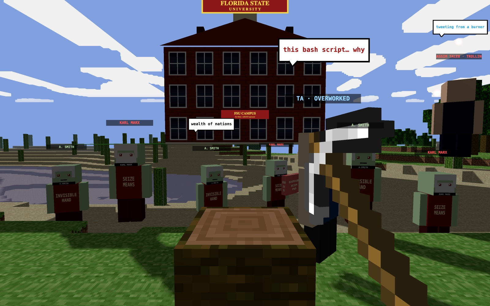

<div align="center">

# 🎮 MarkCraft

### _A voxel rescue mission. Built in Three.js. Save the professor, fight the Taleb dragon, tour Harvard Yard._

[](https://evan555555555555555.github.io/markcraft-clone/)

[](LICENSE)
[](CONTRIBUTING.md)
[](CODE_OF_CONDUCT.md)
[](https://threejs.org)
[](https://vitejs.dev)
[](Dockerfile)

### **[▶ Play it now in your browser](https://evan555555555555555.github.io/markcraft-clone/)** · _no install, no download, just click_



</div>

## 🎯 The one-line pitch

**You are Unc Marks, the only Harvard economist with the moral fortitude to rescue the professor. Slay the Taleb dragon, pass economics, get unblocked on Twitter.**

## 📸 Gallery

<div align="center">
  
  
</div>

## ⚡ Why MarkCraft exists

Built in two weeks by three students who committed copyright infringement for a grade. The base voxel engine is [dgreenheck's Three.js Minecraft clone](https://github.com/dgreenheck/minecraft-threejs-clone) — everything else (Harvard / Columbia / FSU campuses, the Taleb dragon, voxel NPCs with speech bubbles, neon stages, fireworks, loading screen, music player) is custom.

About 90% of the MarkCraft-specific code was written with Claude Code. That part was fast. The other 10% — port binding, asset loading, boot order — took all the time.

## 📖 The lore

Steve got fired for a bash assignment he forgot to grade. You are **Unc Marks**, the only Harvard economist with the moral fortitude to rescue him. Also you have a pickaxe.

The zombies are **Adam Smith**. Hit one — it drops a pamphlet on the invisible hand. Collect 100 to unlock a Harvard Economics degree. It does nothing. Welcome to economics. Kill enough and they respawn as **Karl Marx**. Now they're hitting you.

The final boss is the **Nassim Taleb dragon**. He attacks anyone who prepared for the fight. He sets you on fire. He tweets about it from a burner.

**Your allies:** N.W.A. on the boombox, 2 Live Crew on backup vocals, Linus Torvalds wielding the ADA Compliance sword (+999 to lawsuits), the FSU Penguin, and one (1) Tux for moral support.

**Mission:** slay the dragon, get Unc Marks unblocked on Twitter, **pass economics.**

## ✨ Features

- 🌍 **Procedural voxel world** with 4 biomes (tundra, temperate, jungle, desert)
- 🏛️ **Harvard Yard** with VERITAS shield, Columbia Law posters, LIS3353 signs, and the FSU campus
- 🧟 **Voxel NPCs**: Unc Marks, Adam Smith zombies, Karl Marx, the Dean, 2 Live Crew, N.W.A., Linus Torvalds, FSU Penguin
- 🐉 **Taleb dragon boss** — segmented body, wings, fire, tweets
- 🎵 **In-game music player** with HUD widget, hotkeys (`M` toggle, `N` next), and a simple "drop an .mp3 and it works" track list
- 💬 **Speech bubbles** — NPCs shout lore at you as you walk past
- ⛏️ **Full terraforming** — break and place any block, save your world with `F1`, load it with `F2`
- 🔧 **Dev panel** (`U`) for physics, biomes, draw distance, fog — great for debugging and showing off
- 🎆 **Fireworks, snow particles, neon stages**, because why not
- 💾 **Portable builds** — `dist/` runs from any folder, any server, or just `file://` — zip it, email it, drag it to a thumb drive
- 🐳 **Docker support** — one command, production nginx image, done

## 🚀 Quick start — pick your flavor

### 🌐 Just play it (browser, zero install)

👉 **https://evan555555555555555.github.io/markcraft-clone/**

### 💻 Run locally (dev mode with hot reload)

```bash
git clone https://github.com/evan555555555555555/markcraft-clone.git
cd markcraft-clone
npm install
npm start
```

Open <http://localhost:5173>.

### 🐳 Run in Docker (production nginx, one command)

```bash
docker compose up --build
```

Open <http://localhost:8080>. Stop with `docker compose down`.

Plain Docker:

```bash
docker build -t markcraft .
docker run -p 8080:80 markcraft
```

### 📦 Build a portable copy

```bash
npm run build
```

`dist/` is fully self-contained — open `dist/index.html` in any browser, or host it anywhere. No server config required (Vite uses a relative base).

## 🎮 Controls

| Key        | Action               |
| ---------- | -------------------- |
| `WASD`     | Move                 |
| `SHIFT`    | Sprint               |
| `SPACE`    | Jump                 |
| `1`–`8`    | Select block         |
| `0`        | Pickaxe              |
| `M`        | Toggle music         |
| `N`        | Next track           |
| `R`        | Reset camera         |
| `U`        | Toggle dev panel     |
| `F1` / `F2`| Save / load world    |
| `F10`      | Spectator (orbit) camera |

Click anywhere to grab the mouse. If pointer lock is blocked (mobile, some corporate browsers), `F10` still works.

## 🛠️ Tech stack

| What       | Why                                                                    |
| ---------- | ---------------------------------------------------------------------- |
| **Three.js** ([r156](https://threejs.org))  | 3D scene, meshing, lighting, camera                      |
| **Vite 4**  ([vitejs.dev](https://vitejs.dev))  | Dev server with HMR + production bundler                |
| **Plain ES modules** | No TypeScript, no framework — stays readable                  |
| **Canvas 2D** | Procedural textures (faces, bricks, speech bubbles)                 |
| **Web Audio / `<audio>`** | Music player and sound effects                          |
| **localStorage** | Save / load world via `dataStore.js`                             |
| **Docker + nginx** | Production container image (multi-stage build)                 |
| **GitHub Pages** | Live deploy target (`gh-pages` branch, `.nojekyll`)              |

## 🏗️ Architecture

```
main.js → loadingScreen → World (chunks) + Player (input/camera)
                        + Physics (collisions)
                        + EntityManager (NPCs, dragon, campus)
                        + Music player + Dev panel UI
```

See **[ARCHITECTURE.md](ARCHITECTURE.md)** for a file-by-file breakdown of every script, what it does, and where to add new features. It has a handy "you want to add X? edit these files" table.

## 🗺️ Roadmap

**Shipped in v1.0.0:**
- [x] Harvard / Columbia / FSU campuses
- [x] Voxel characters with procedural skins
- [x] Adam Smith / Karl Marx zombie system
- [x] Taleb dragon boss
- [x] Speech bubble system
- [x] HUD music player with track list
- [x] Loading screen + WebGL fallback
- [x] Docker + GitHub Pages deploy
- [x] Full contributor docs

**Under consideration:**
- [ ] Real combat / HP for the dragon fight
- [ ] Inventory management
- [ ] Crafting system
- [ ] Item drops from NPCs
- [ ] Touch controls for mobile
- [ ] More music tracks (PRs very welcome)
- [ ] Real multiplayer (big scope — needs an issue discussion first)

Got an idea? [Open a feature request](https://github.com/evan555555555555555/markcraft-clone/issues/new?template=feature_request.yml) or vote on existing ones.

## 🎵 Add your own music

Drop an `.mp3` into [`public/audio/`](public/audio) and add it to the `TRACKS` array in [`scripts/audio.js`](scripts/audio.js):

```js
export const TRACKS = [
  { title: 'Straight Outta Compton', artist: 'N.W.A.', src: './audio/straight-outta-compton.mp3' },
  { title: 'Your New Track',         artist: 'Artist', src: './audio/your-new-track.mp3' }
];
```

The track switcher in the top-left picks them up automatically. That's it. No build step, no registration, no config.

## 🤝 Contributing

**PRs welcome.** Start here:

- **[CONTRIBUTING.md](CONTRIBUTING.md)** — fork/branch/PR flow + good-first-issue list
- **[ARCHITECTURE.md](ARCHITECTURE.md)** — what every file does
- **[CODE_OF_CONDUCT.md](CODE_OF_CONDUCT.md)** — how we treat each other
- **[SECURITY.md](SECURITY.md)** — responsible disclosure

**Great first PRs:** add a music track · add a new NPC or speech quote · add a new block type · fix something on the bug board.

Run `npm run build` locally before pushing — the build must succeed.

## 💬 Community

- 🗨️ **[Discussions](https://github.com/evan555555555555555/markcraft-clone/discussions)** — ask a question, share a mod, post a screenshot
- 🐛 **[Issues](https://github.com/evan555555555555555/markcraft-clone/issues)** — bug reports and feature requests
- 📰 **[Changelog](CHANGELOG.md)** — what's new, version by version
- ❓ **[FAQ](FAQ.md)** — common questions before you ask

## 🔐 How this repo is protected

All changes to `main` require a pull request. Force-pushes are blocked. Branch deletion is blocked. Secret scanning + push protection is on. Read **[GOVERNANCE.md](GOVERNANCE.md)** for the full threat model, branch protection rules, and who can do what. Contributors don't need to do anything special — just open PRs like normal.

## 🔧 Troubleshooting

<details>
<summary><strong>Black screen / "Could not create a WebGL renderer"</strong></summary>

Your browser has WebGL disabled or no GPU acceleration.

- **Chrome:** Settings → System → enable "Use hardware acceleration" → relaunch. Visit `chrome://gpu` — WebGL / WebGL2 should be green.
- **Safari:** Develop menu → Experimental Features → enable WebGL 2.0.
- **Firefox:** `about:config` → `webgl.disabled` = `false`.
- Still broken? Hit **RETRY** on the error screen. If that fails, try a different browser.

</details>

<details>
<summary><strong>Stuck on "click to look around"</strong></summary>

Browsers require a user gesture before grabbing the mouse. Click the game window once. If pointer lock is blocked entirely (mobile, strict corporate browsers), press `F10` for spectator mode.

</details>

<details>
<summary><strong>No sound</strong></summary>

Browsers require a user gesture before playing audio. The **[ ENTER MARKCRAFT ]** button on the loading screen counts. If music still doesn't play, press `M` to retry or hit the play button in the top-left widget.

</details>

<details>
<summary><strong>Laggy on my machine</strong></summary>

Press `U` to open the dev panel, then lower **Draw Distance** under *World*. Each unit is roughly a ring of chunks — `3` is default, drop to `2` or `1` on older hardware.

</details>

## 🏆 Credits

Built by **Evan**, **Mehdi**, and **Amadou** with heavy assistance from [Claude Code](https://claude.com/claude-code).

The base voxel engine is [dgreenheck/minecraft-threejs-clone](https://github.com/dgreenheck/minecraft-threejs-clone) — thanks to [Dan Greenheck](https://github.com/dgreenheck) for the open-source voxel tutorial. Everything custom to MarkCraft (campuses, dragon, voxel characters, stages, music switcher, loading screen, speech bubbles) is in this fork.

Music: _Straight Outta Compton_ by N.W.A.

Inspiration: Professor Marks, who we hope gets unblocked on Twitter.

## 📜 License

[MIT](LICENSE) — do whatever. If you ship something based on this, a link back is nice but not required.

---

<div align="center">

_Held together by Docker, ngrok, and prayer. Syllabus pending IRB review._

**[▶ Play MarkCraft](https://evan555555555555555.github.io/markcraft-clone/)** · **[Contribute](CONTRIBUTING.md)** · **[Architecture](ARCHITECTURE.md)** · **[FAQ](FAQ.md)**

</div>
