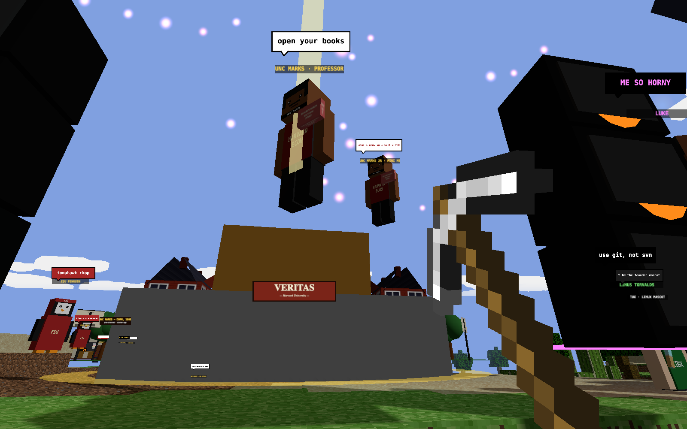

# MarkCraft

> A voxel rescue mission. Built in Three.js. Save the professor, fight the Taleb dragon, tour Harvard Yard.

[](https://evan555555555555555.github.io/markcraft-clone/)
[](LICENSE)
[](CONTRIBUTING.md)
[](https://threejs.org)

## **[▶ Play it now in your browser](https://evan555555555555555.github.io/markcraft-clone/)**

No install. No download. Just click and play.



## The lore

Steve got fired for a bash assignment he forgot to grade. You are **Unc Marks**, the only Harvard economist with the moral fortitude to rescue him. Also you have a pickaxe.

The zombies are **Adam Smith**. Hit one — it drops a pamphlet on the invisible hand. Collect 100 to unlock a Harvard Economics degree. It does nothing. Welcome to economics. Kill enough of them and they respawn as **Karl Marx**. Now they're hitting you.

The final boss is the **Nassim Taleb dragon**. He attacks anyone who prepared for the fight. He sets you on fire. He tweets about it.

**Your mission:** slay the dragon, get Unc Marks unblocked on Twitter, pass economics.

## Features

- Procedural voxel world with biomes (tundra, temperate, jungle, desert)
- Harvard Yard campus with Columbia Law and LIS3353 posters
- Voxel NPCs: professors, zombies, dean, 2 Live Crew, N.W.A., Linus Torvalds
- Taleb dragon boss fight
- In-game music player (N.W.A. on the boombox — press `M` to toggle, `N` for next track)
- Terraforming: place and break blocks
- Save/load your world (`F1` / `F2`)
- Dev panel for tweaking physics, biomes, draw distance
- Fireworks, snow, speech bubbles, the works

## Play locally

Requires [Node.js 18+](https://nodejs.org/).

```bash
git clone https://github.com/evan555555555555555/markcraft-clone.git
cd markcraft-clone
npm install
npm start
```

Open <http://localhost:5173>.

## Build a standalone copy

```bash
npm run build
```

The `dist/` folder is fully self-contained — open `dist/index.html` in any browser, or zip it and email it. `vite.config.js` uses a relative base so no server config needed.

## Run in Docker

One command, full production build, served by nginx on port 8080:

```bash
docker compose up --build
```

Open <http://localhost:8080>. To stop: `docker compose down`.

Plain Docker (no compose) works too:

```bash
docker build -t markcraft .
docker run -p 8080:80 markcraft
```

## Controls

| Key | Action |
| --- | --- |
| `WASD` | Move |
| `SHIFT` | Sprint |
| `SPACE` | Jump |
| `1`–`8` | Select block |
| `0` | Pickaxe |
| `M` | Toggle music |
| `N` | Next track |
| `R` | Reset camera |
| `U` | Toggle dev panel |
| `F1` / `F2` | Save / load |
| `F10` | Spectator (orbit) camera |

Click anywhere to grab the mouse. If pointer lock is blocked (mobile, some corporate browsers), hit `F10` for spectator mode.

## Add your own music

Drop an `.mp3` into `public/audio/` and add it to the `TRACKS` array in [`scripts/audio.js`](scripts/audio.js):

```js
export const TRACKS = [
  { title: 'Straight Outta Compton', artist: 'N.W.A.', src: './audio/straight-outta-compton.mp3' },
  { title: 'Your New Track',         artist: 'Artist', src: './audio/your-new-track.mp3' }
];
```

The track switcher in the top-left picks them up automatically.

## Contributing

PRs welcome. See **[CONTRIBUTING.md](CONTRIBUTING.md)** for how to get started, what's in scope, and where the easy wins are. Short version: fork, branch, code, `npm run build`, open a PR.

Good first issues: more music tracks, more NPCs, funnier speech bubbles, new blocks, bug fixes.

## Troubleshooting

- **Black screen on boot** — the loader detects WebGL and shows a friendly error if it's missing. Try a different browser (Chrome / Firefox), update graphics drivers, or hit **RETRY**.
- **Stuck on "click to look around"** — single-click the page to grab the mouse. If pointer lock is blocked entirely, press `F10` for spectator camera.
- **No sound** — browsers require a user gesture before audio plays. The loading screen's **[ ENTER MARKCRAFT ]** button counts. If music still doesn't play, hit `M` or use the play button.
- **Slow on a big map** — press `U`, lower **Draw Distance** under World.

## Credits

Built on top of [dgreenheck/minecraft-threejs-clone](https://github.com/dgreenheck/minecraft-threejs-clone) — voxel engine, chunking, physics, biomes, save/load. Everything else (Harvard / Columbia campus, Taleb dragon, voxel characters, stages, fireworks, music switcher, loading screen, speech bubbles) is custom for MarkCraft.

~90% of the MarkCraft code was written with Claude Code. That part was fast. The other 10% — port binding, asset loading, boot order — took all the time.

## License

[MIT](LICENSE) — do whatever. If you ship something based on this, a link back is nice but not required.
